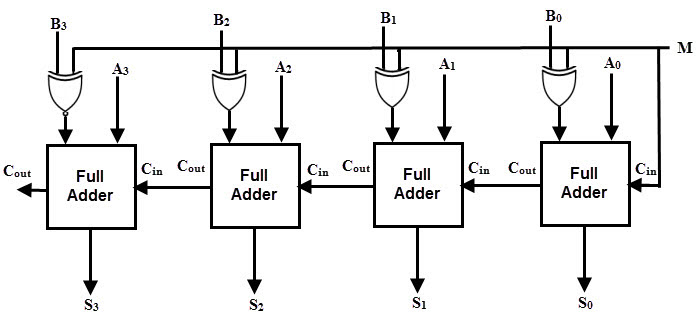

Multiple level circuits can have reduced gate input costs compared to two-level (SOP/POS) circuits. It is performed by applying transformations to circuits represented by equations while evaluating cost.

We typicall use algebraic manipulations (not using axioms), not boolean manipulations (using axioms). We express a function $$F$$ as a function of $$G$$ and some or all of its variables.

For example,

$$F = \overline{A}\overline{C}\overline{D} + \overline{A}B\overline{C} + ABC + AC\overline{D}$$

uses $$16$$ gates, has cost $$32$$, and delay $$7$$ whereas

$$F=(\overline{A}\overline{C} + AC)(B+\overline{D})$$

uses $$10$$ gates, has cost $$20$$, and delay $$6$$.

We usually face a trade-off between cost and delay. Making circuits multi-level increases delay and decreases cost. To do this, we use _factoring_, _decomposition_, and _substitution_.

A half adder adds to binary inputs to give a sum bit and a carry bit.    
A full adder adds three bits and does the same. For input $$a$$, $$b$$, $$c$$, the sum bit is equal to $$a\oplus b\oplus c$$. We can create a full adder by stacking two half adders.

We can use a full adder to add strings of bits. For example, a _ripple carry adder_ contains many chained full adders. Technically the first adder in the stack could be a half adder, but we use a full adder with initial carry $$0$$ since we prefer uniformity. Further, we can use a ripple carry adder as a subtractor by giving the initial input carry bit as $$1$$ instead of $$0$$ and inverting each bit. We can then build a single adder/subtractor circuit as

However, since we wait for the output of all the previous bits before calculating for a particular bit, it is quite slow and takes $$\mathcal{O}(n)$$ time to add. This is known as propagation delay - the carry must ripple from the MSB to the LSB. As a result, it is very slow if we have many bits. We can also use a ripple carry adder to subtract.