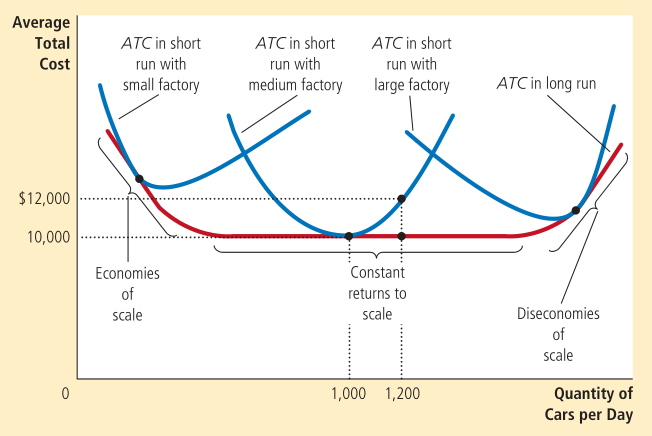

In the short run, some costs are fixed. In the long run, all fixed costs become variable costs.    
As a result, a firm's long-run cost curves differ from its short-run cost curves. The lower envelope of the short-run total average cost curve forms the long-run total average cost curve. 

_Economies of scale_ refer to the property whereby long-run average total cost falls as the quantity of output increases.    
_Diseconomies of scale_ refer to the property whereby long-run average total cost rises as the quantity of output increases.    
_Constant economies of scale_ refer to the property whereby long-run average total cost stays constant as the quantity of output increases.

Economies of scale usually occur due to the workers specializing in particular areas. Diseconomies of scale on the other hand might occur due to coordination problems.

In a _competitive market_,
* There are many buyers and sellers
* The goods offered by the various sellers are largely the same

Each buyer and seller is a price taker. They must accept the price determined by the market.

In a _perfectly competitive market_, in addition to the above two conditions, firms can further freely enter/exit the market.    
So, the actions of any single buyer/seller have negligible impact on the market price. The average revenue for any firm is equal to the price of the good. The marginal revenue is also equal to the price of the good and the total revenue is proportional to the quantity of output.     
Any firm decides to increase/decrease its output depending on whether the marginal revenue is greater/less than the marginal cost. Because the firm's marginal cost curve determines the quantity of good the firm is willing to supply at any price, the marginal cost curve is equal to the supply curve.

In the short run, it is difficult to leave the market whereas it is easy in the long run.     
A _shutdown_ refers to a short run decision to not produce anything in some period of time due to market conditions. In the short run, the fixed costs cannot be avoided so they continue to be incurred even if a shutdown occurs. This fixed cost is said to be a _sunk cost_.    
 _Exit_ refers to a long run decision to leave the market. When a firm exits the market, it needs to incur neither fixed nor variable costs.    
The firm shuts down if the revenue it would earn from producing is less than the variable costs of production. Alternatively, it shuts down if the price is less than the average variable cost.    
The firm decides to exit if the revenue is less than the average total cost or alternatively, the price is less than the average total cost.

Therefore, the firm's short run supply curve is that portion of the marginal cost curve which is above the average variable cost curve.    
The long run supply curve has the portion of the marginal cost curve which is above the average total cost curve.

<!-- In the short run, some costs are fixed. In the long run, all fixed costs become variable costs.    
As a result, a firm's long-run cost curves differ from its short-run cost curves. The lower envelope of the short-run total average cost curve forms the long-run total average cost curve. 

_Economies of scale_ refer to the property whereby long-run average total cost falls as the quantity of output increases.    
_Diseconomies of scale_ refer to the property whereby long-run average total cost rises as the quantity of output increases.    
_Constant economies of scale_ refer to the property whereby long-run average total cost stays constant as the quantity of output increases.

A _competitive market_ has many buyers and sellers trading identical products so that each buyer and seller is a price taker. They must accept the price determined by the market.

In a _perfectly competitive market_, firms can further freely enter/exit the market. So, the actions of any single buyer/seller have negligible impact on the market price. The average revenue equals the price of the good. The total revenue is proportional to the output.    
In the short run, it is difficult to leave the market whereas it is easy in the long run. A _shutdown_ refers to a short run decision to not produce anything in some period of time due to market conditions. _Exit_ refers to a long run decision to leave the market. The firm shuts down if the revenue is less than the average variable cost. The firm exists if the revenue is less than the average total cost.

Profit is maximised when the marginal revenue is equal to the marginal cost. -->