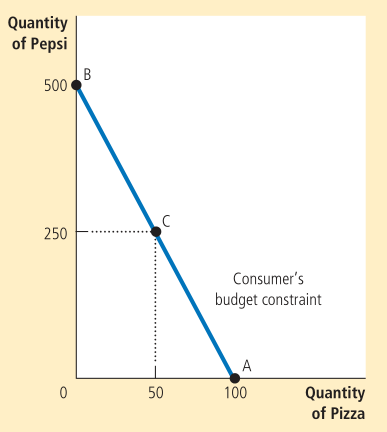

Consumer surplus measures the benefit the buyer receives from a good as they perceive it.

_Producer surplus_ is the amount a seller is paid for a good minus the cost. Just like before, the area above the supply curve and below the price measures the producer surplus.

The _total surplus_ is the sum of the consumer surplus and producer surplus. A resource allocation is said to exhibit _efficiency_ if it maximizes total surplus. _Equality_ (or equity) checks whether the producers and consumers have similar levels of economic wellbeing.

* Free markets allocate the supply to buyers who value them most (as measured by their willingness to pay).
* Free markets allocate the demand to sellers who can produce them at the lowest cost.
* Free markets produce the quantity of goods that maximizes the sum of consumer and producer surplus.

Therefore, a social planner should leave a free market alone. This is referred to as _laissez faire_ - letting people do as they will.    
This is not the case when there is a market failure due to externalities or market power.    
The resulting inefficiency shows itself as _deadweight loss_, which is equal to the corresponding fall in total surplus.    
Imposing a tax can manifest in a deadweight loss.
When buyers/sellers do not take externalities into account, the equilibrium could be inefficient. 

The theory of consumer choice asks
* whether all demand curves slope downward,
* how wages affect labor supply, and
* how interest rates affect household saving.

_Budget constraint_ depicts the limit on the consumption bundles that a consumer can afford.    
It limits the various combinations of goods that the consumer can afford given their income and the prices. A budget constraint curve looks like:

The slope of the curve is equal to the ratio of the two prices, the _relative price_.    
We should also take preferences into account. For this, we draw the indifference curve.

An _indifference curve_ shows consumption bundles that give the consumer the same level of satisfaction. The slope at any point represents how much of one good the consumer is willing to give up for one unit of the other - this is known as the _marginal rate of substitution_.

The slope at any point on an indifference curve is the _marginal rate of substitution_. It represents how much of one good the consumer is willing to give up for one unit of the other.