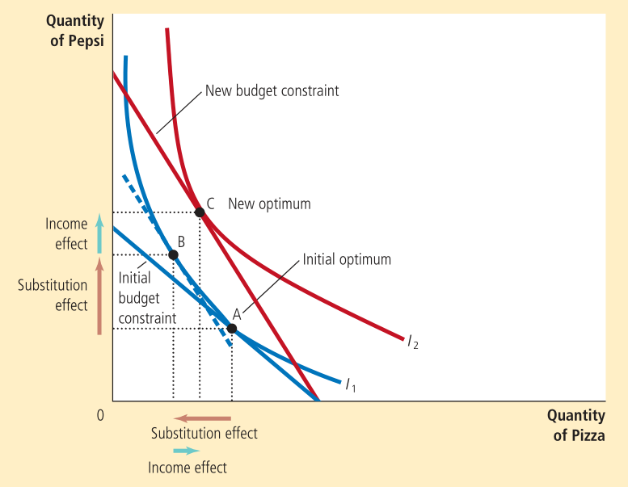
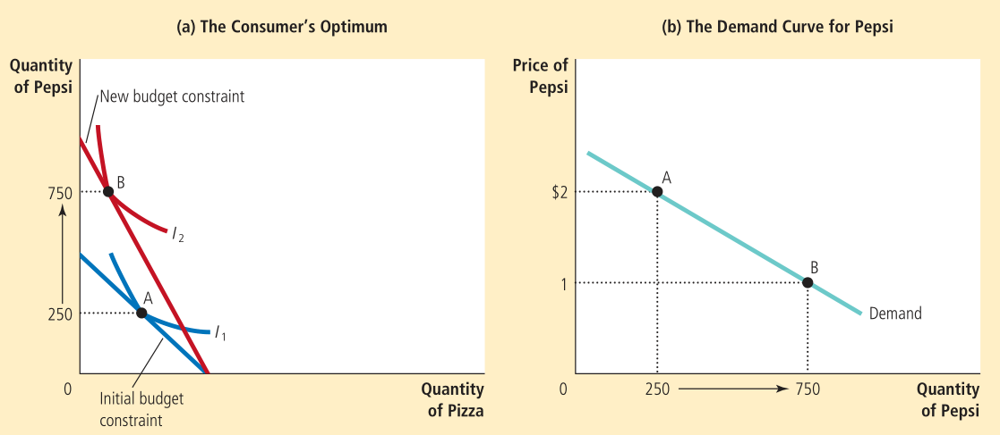

A fall in the price of some good rotates the budget constraint curve. This changes the slope as well. It pivots around the point of intersection corresponding to the price that has not changed.

The change due to the income and substitution effects can be thought to occur in two parts.

The change from A to B is the substitution effect, where we move along the same indifference curve. The change from B to C is the income effect, where the two points have the same marginal rate of substitution. C is the optimum for the corresponding indifference curve.

Now, we can derive the demand curve of the consumer using the budget constraint and indifference curves. This can be understood using the following example.

It is also possible for the demand curve to slope upwards if the income effect strongly dominates the substitution effect for an inferior good. Such a good that violates the law of demand is known as a _Giffen good_. As the cost increases, the quantity demanded increases as well.    
For normal good, the income effect results in an increase in consumption whereas for an inferior good, it results in a decrease in consumption. Therefore, for normal goods, both the effects work in the same direction and the consumption increases when price increases. For an inferior good, they work in opposite directions.