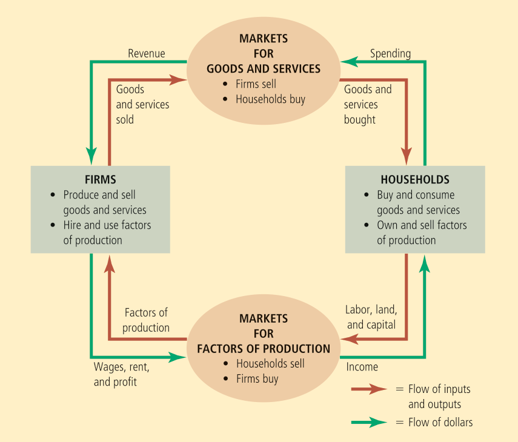

Economists make assumptions to simplify the study of the surrounding world. For example, we may assume that prices don't change too much in the short run.

The _circular flow diagram_ is a visual model of the economy that shows how money flows through markets among households and firms. The inputs to firms such as labor, land, and capital, are called the _factors of production_. The two major markets involved are:
* Markets for goods and services (firms sell and households buy)
* Markets for factors of production (households sell and firms buy)

<!--  -->

The circular flow diagram doesn't show everything, factors such as the government and international trade are not shown at all.

The _production possibilities frontier_ is a graph that shows the combinations of output that the economy can produce given the available factors of production and technology.

An outcome is _efficient_ if the economy is getting all it can given the constraints. Points on (not inside) the PPF such as A, B, E, F represent efficient outcomes. Note that the PPF shows one of the trade-offs we may face. It also shows the opportunity cost of one good measured in terms of another good.    
Further note that if we are at, say, F, then the workers who are skilled in car-related areas are also working on computers. The PPF usually has this shape and is steeper towards the middle. If the techonology for something becomes better, then the PPF will expand along the corresponding axis.    
Obviously, it is extremely difficult to get the exact PPF. It is the duty of the government to introduce suitable taxes/subsidies to ensure that the outcome is efficient.