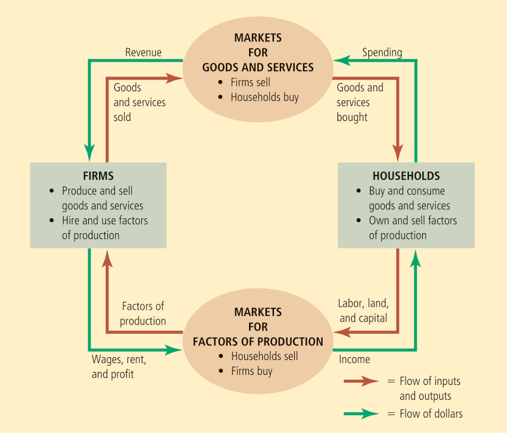
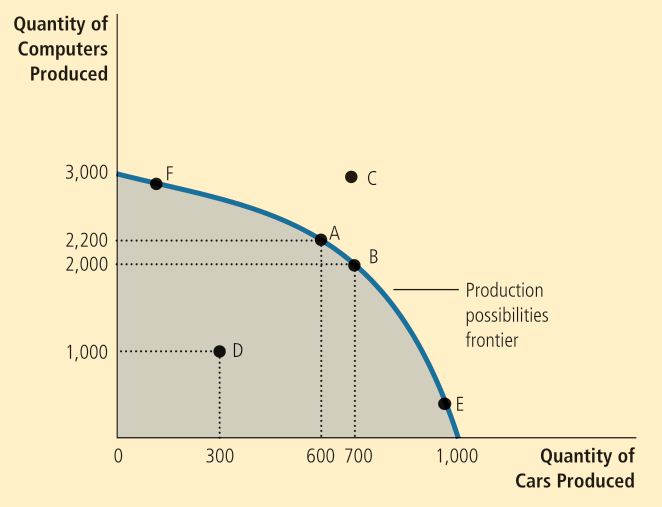
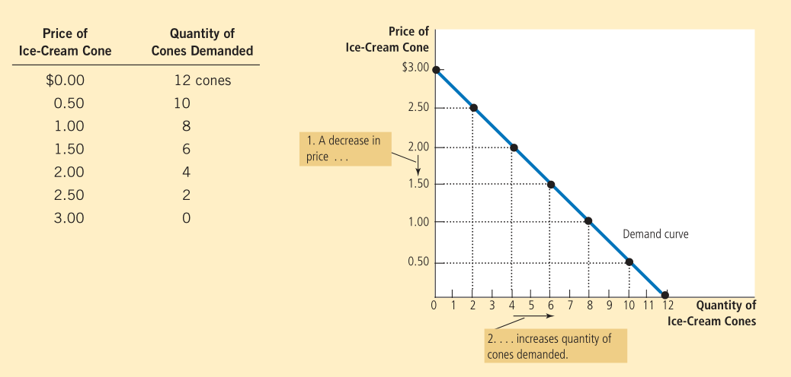
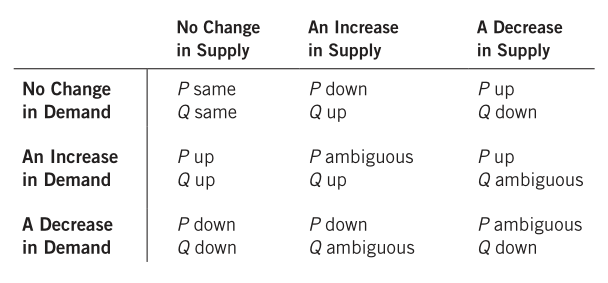

Most of the content and all images used are from the book "Principles of Economics" by Gregory Mankiw.

<!-- MarkdownTOC autolink="true" -->

- [Lecture 1](#lecture-1)
- [Lecture 2](#lecture-2)
- [Lecture 3](#lecture-3)
- [Lecture 4](#lecture-4)
- [Lecture 5](#lecture-5)
- [Lecture 6](#lecture-6)
- [Lecture 7](#lecture-7)
- [Lecture 8](#lecture-8)
- [Lecture 9](#lecture-9)
- [Lecture 10](#lecture-10)

<!-- /MarkdownTOC -->

# Lecture 1

_Economics_ is the study of how society manages its scarce resources.

1. There is no such thing as a free lunch. The common trade-off is between efficiency (society is making the best of the scarce resources) and equality (benefits are distributed equally).

2. The _opportunity cost_ of an item is what we give up to get something - the greatest cost in going to college is not money, but time, which is an opportunity cost.

3. Economists assume that people are rational and look at things _marginally_ - the changes that occur when we make a small change to our plan of action. Rational people make decisions by looking at marginal benefits and costs.

4. People respond to incentives. When policymakers fail to consider how their policies affect incentives, there are often unintended consequences. Example: see page 8 (seatbelt law)

5. Trade can make everyone better off. People gain from their ability to trade and competition results in gains from trading. Trade allows people to specialize in what they want.
There is something called the Robinson Crusoe economy wherein there is no possibility of trade (Robinson Crusoe was the only person on the island so he had to produce all the goods for all his needs). This is a _protectionist_ approach and tries to make the units completely self-reliant. On the other hand, _liberalism_ asks people to focus on their strengths and encourages trade.

6. Markets are (usually) a good way to organize economic activity. A _market economy_ allocates resources through the decentralized decisions of many firms as they interact in markets. It is a decentralist approach. Households/firms _separately_ decide who/what to hire/work for/buy/produce.
Adam Smith observed that households/firms act as if they are guided by an "invisible hand". Althought they act separately, the system doesn't crash. This invisible hand is just supply and demand and prices are the instrument using which 「the hand」 directs market activity.
Because households/firms look at prices when they make decisions, they unkowingly account for the social costs of their actions. Individual supply and demands get converted to social supply and demands, which results in the aggregating of individual entities. This results in decision makers reaching outcomes that maximise the welfare of society.
When this invisible hand is disrupted (perhaps by the government), there can be adverse affects such as how taxes adversely affect resource allocation.

7. Governments can improve market outcomes. The invisible hand only works if the government enforces the rules and maintains the key institutions. If left to their own, it is possible that agents reach inferior solutions. After independence, it was nearly completely centralized. Markets work only if property rights are introduced. For free market economies to work and maximise societal welfare, it is paramount to ensure that the citizens' property rights are upheld.
_Market failure_ is said to occur when the market fails to allocate resources efficiently. If it fails, the government can intervene to promote efficiency. Failure could occur due to 
	* lack of property rights.
	* an _externality_ - the impact of one person/firm's action on the well-being of a bystander. If we have an Adam Smith structure, it is difficult for externalities to occur. Externalities in general can be good or bad. An example is passive smoking, which is a bad externality.
		<!-- Passive smoking of bystanders can be thought of as a bad externality. This isn't reflected in the private market as the price of cigarettes (in a free market economy), but is occurring nevertheless with bystanders being adversely affected. -->
    * _market power_, which is the ability of a single person/firm to influence market prices. An example is monopolization.

# Lecture 2

Economists make assumptions to simplify the study of the surrounding world. For example, we may assume that prices don't change too much in the short run.

The _circular flow diagram_ is a visual model of the economy that shows how money flows through markets among households and firms. The inputs to firms such as labor, land, and capital, are called the _factors of production_. The two major markets involved are:
* Markets for goods and services (firms sell and households buy)
* Markets for factors of production (households sell and firms buy)

<!--  -->

The circular flow diagram doesn't show everything, factors such as the government and international trade are not considered at all.

The _production possibilities frontier_ is a graph that shows the combinations of output that the economy can produce given the available factors of production and technology.

An outcome is _efficient_ if the economy is getting all it can given the constraints. Points on (not inside) the PPF such as A, B, E, F represent efficient outcomes. Note that the PPF shows one of the trade-offs we may face. It also shows the opportunity cost of one good measured in terms of another good.    
Further note that if we are at, say, F, then the workers who are skilled in car-related areas are also working on computers. The PPF usually has this shape and is steeper towards the middle. If the technology for something becomes better, then the PPF will expand along the corresponding axis.    
Obviously, it is extremely difficult to get the exact PPF. It is the duty of the government to introduce suitable taxes/subsidies to ensure that the outcome is efficient.

# Lecture 3

_Microeconomics_ focuses on the individual parts of the economy and how households/firms make decisions and interact in specific markets, whereas _macroeconomics_ looks at the economy as a whole, looking at economy-wide phenomena such as inflation, unemployment, and economic growth.    
Since macroeconomics is essentially made up of a large number of microeconomic systems, it is impossible to understand the former without the latter.

_Positive statements_ are descriptive and attempt to describe the world as it is, whereas _normative statements_ are prescriptive and are statements about how the world should be.    
The validity of positive statements can be decided by observing the facts already present, whereas the validity of normative statements are far more subjective in nature.    
Economists may disagree about the validity of different positive theories on how the world works. They may also have different ideals and thus different normative views.

A _market_ is a group of buyers and sellers of a particular good/service.    
A _competitive market_ is one where are there are many buyers and sellers so that each has a negligible impact on the market price. A seller has little reason to sell at a lower price than the market price and he cannot sell at a higher price because then, buyers will go elsewhere. In _perfectly competitive markets_ (all the goods are the same and no individual buyer/seller can influence the market), buyers and sellers are said to be _price takers_.     
A _monopoly_ on the other end of the spectrum is a single seller who sets the price.    
An _oligopoly_ means there are not many sellers and the competition is not very aggressive. For example, the telecom market.      
_Monopolistic competition_ (monopoly + competition) has many sellers and slightly differentiated products. Each seller may set the price for their own product. For example, the hotel market.

The _quantity demanded_ is the amount of a good that buyers are willing and able to purchase.    
The _law of demand_ states that, other things equal, the quantity demanded of a good falls when the price of the good rises.    
The law of demand doesn't always hold. For example, in the stock market, the usual rule of thumb is to buy more when the price of the stocks increases. Another example is paintings/antiques in auctions.    
The _demand schedule_ is a table showing the relation between the price and the quantity demanded. When the law of demand holds, the two have an inverse relationship.    
The _demand curve_ is a graph of the two (with the price on vertical axis and the quantity demanded on the horizontal).    
The following is an example of a demand schedule and curve (following the law of demand).

# Lecture 4

The _market demand_ refers to the sum of all the individual demands for a particular good. The market demand curve can be obtained by horizontally summing the individual demand curves.

If a change in some factor shifts the demand curve to the right, it corresponds to an increase in demand (and a shift to the left corresponds to a decrease in demand). Recall that we said "other things constant" while stating the law of demand. What are these other things?

* Income - A _normal good_ is a good for which the demand increases as consumer income increases. A good for which demand falls as income rises is called an _inferior good_.
* Prices of related goods - When a fall in the price of one good reduces the demand for another good, they are called _substitutes_. When a fall in the price of one good increases the demand of another, they are called _complements_.
* Tastes - If general tastes become more tailored towards the product, then demand increases. We don't often try to explain tastes since they are heavily influenced by factors psychological in nature.
* Expectations - If expectations for the future increase, then demand increases, even if there is no logical reason for the rise of expectation in the first place (_self-fulfilling expectations_). For example, if we expect an increase in our income, we might save less now and spend more.
* Number of buyers - As the number of buyers increases, the demand increases.

It is important to note that changing the price of some good does not result in a shift of the curve, it merely means that we are moving along the curve.

Similar to the definitions for demand, we have various parameters related to supply - quantity supplied, the law of supply, supply schedule, supply curve, and market supply. The law of supply states that other things constant, the quantity supplied of a good rises when its price rises.

# Lecture 5

If a change in some factor shifts the supply curve to the right, it corresponds to an increase in supply (and a shift to the left corresponds to a decrease in supply). What are the factors that can cause a shift in the curve?

* Input Prices - If the prices of goods that serve as input (say sugar for ice-cream) in making the good increase, the curve shifts to the left.
* Technology - If the technology advances, the curve shifts to the right.
* Expectations - If the price of some good is expected (by the firm) to increase in the future, the curve shifts to the left because they start hoarding the product. This assumes the good is durable. If it is perishable, we need to sell it by the expiry date anyway.
* Number of sellers - If the number of sellers increases, the curve shifts to the right.

It should be noted that the supply (demand) curve does not take demand (supply) into consideration explicitly.

_Equilibrium_ is the situation where the quantity supplied is equal to the quantity demanded. The _equilibrium price_ and _equilibtium quantity_ are the corresponding price and quantity. This is just the point of intersection of the supply and demand curves. The equilibrium price is also known as the "market-clearing price". 

If the price is higher than the equilibrium price, then the supply is high and the demand is low. This is known as an _excess-supply_ situation. The excess supply is known as a _surplus_. Since the sellers need to clear their excess, the price decreases until the equilibrium is reached.    
Similarly, if the price is lower than the equilibrium price, we are in an _excess-demand_ situation. The excess demand is known as a _shortage_. Here, the sellers realize that they need to sell more and they drive up the price until the equilibrium is reached.    
Therefore, regardless of how the original situation is, we converge to the equilibrium assuming there are no barriers to this. This phenomenon is known as the _law of supply and demand_ - the price of any good adjusts to bring the quantity supplied and demanded into balance.

Note that this phenomenon is just Adam Smith's "invisible hand" mentioned in the first lecture and the price system is how it influences the economy.

The earlier discussion about shifts of the supply and demand curves can now be used to analyze the shift in equilibria as well. The following table describes how it changes with shift in the curves.

As an aside, it is worth noting that in digital markets, since information transfer is very fast, it doesn't take too long to attain the new equilibrium if the equilibrium shifts.

# Lecture 6

<!-- Price is the explanatory variable and supply/demand is the dependent variable. If the curve is mapped with price on the X-axis, it is sometimes known as the inverse supply/demand curve. -->

If we map the demand/supply curve with the price on the X-axis instead of the Y-axis, it is sometimes known as the inverse demand/supply curve.

The _price elasticity of supply_ measures how much the quantity supplied changes with the price. If the supply changes substantially with a change in price, it is said to be _elastic_. If not, it is called _inelastic_.     
A _perfectly inelastic supply_ is one where the quantity supplied does not depend on the price at all. An example of this is beach-front land - irrespective of the price, there is a constant total amount.

<!-- The _price elasticity of supply_ is a measure of how much the quantity produced changes with the price. It is equal to the percentage change in quantity supplied divided by percentage change in price. Observe that it is always negative. This can be rewritten as $$(\Delta y/\Delta x)/(y/x)$$.    
A _perfectly inelastic_ supply is one where the quantity supplied does not depend on the price at all. For example, beach-front land.    
It quantifies how much the sellers can change the amount of goods they produce.    
 -->
<!-- We can similarly define the price elasticity of demand and related parameters. -->

# Lecture 7

Similar to the price elasticity of supply, we define the _price elasticity of demand_. There are several factors that must be taken into account when analyzing it:
* Availability of substitutes - Goods with close substitutes tend to have higher elasticity because consumers can easily switch between goods.
* Necessities v. luxuries - Necessities usually have inelastic demands whereas luxuries have elastic demands. Whether something is a necessity or a luxury depends on the properties of the buyer, it is not some intrinsic property of the good.
* Definition of the market - By "definition", we mean where we draw the boundaries of the market. Narrowly defined markets such as that of vanilla ice-cream may be very elastic whereas broadly defined markets such as that of food are inelastic.
* Time horizon - If we have a longer time to adjust, the demand tends to be more elastic.

How do we calculate the price elasticity of demand/supply? We divide the percentage change in the demand/supply by the percentage change in the price. To bring about symmetry, we take the percentage change about the midpoint. So for demand, the price elasticity between two points $$(P_1,Q_1)$$ and $$(P_2,Q_2)$$ is

$$\frac{(Q_2-Q_1)/((Q_1+Q_2)/2)}{(P_2-P_1)/((P_1+P_2)/2)}.$$

The price elasticity of supply can be calculated similarly.

The demand is said to be
* _perfectly inelastic_ if the price elasticity is equal to $$0$$,
* _inelastic_ if the price elasticity is between $$0$$ and $$1$$,
* _unitary_ if the price elasticity is equal to $$1$$,
* _elastic_ if the price elasticity is greater than $$1$$, and
* _perfectly elastic_ if the price elasticity is infinite (the demand curve is horizontal).

The _total revenue_ is equal to the price of the good multiplied by the quantity of the good sold.    
The change of the total revenue with price depends on the price elasticity.    
Note that in a perfectly inelastic situation, reducing the price results in the total revenue decreasing proportionately.

* If the demand is inelastic, total revenue and price grow together.
* If the demand is elastic, total revenue and price grow against each other.
* If the demand is unitary, the total revenue does not change with price.

If the demand decreases linearly with price, then it goes from elastic to unitary to inelastic as demand increases.

The _income elasticity of demand_ measures how much the quantity demanded changes with the income of the consumer. Similar to before, it is calculated by dividing the percentage changes in each. Income elasticity is positive for normal goods and negative for inferior goods.

# Lecture 8

The _cross-price elasticity of demand_ measures how the quantity demanded of one good responds to a change in the price of another good. It can be calculated by dividing the percentage change in quantity demanded of the first good by the percentage change in the price of the other good.    
Substitutes have positive cross-price elasticity and complements have negative cross-price elasticity.

Until now, we haven't involved the government at all. In a free, unregulated system, the market forces establish equilibria. While they may be efficient, it needn't be true that everyone is satisfied in this case. It is the economists' duty to use theories to assist the development of policies.    
Price control is enacted only when these policy-makers believe that the market price is unfair to either the buyers or the sellers. This results in price _ceilings_ (legal maximum price) and _floors_ (legal minimum price).    
The price ceiling is said to be _binding_ if it is set below the equilibrium price and _not binding_ if it is set above the equilibrium price. In a competitive market, a binding ceiling results in a shortage and the sellers must ration the scarce goods among the large number of potential buyers.

For example, rent control policy helps the poor by making pricing more affordable (for the poor).    
It is worth noting that rent control is usually considered terrible by economists (despite it sounding good to the general public). As with any binding price ceiling, rent control results in a shortage in the long run. On the supply side, landlords are unmotivated to build new apartments and do not maintain the existing ones. On the demand side, people are encouraged to go out and find a place to live. Further, since there is no incentive for landlords to respond to their tenants' demands, the quality of housing goes down as well. This problem does not show itself in the short run.    
An example of a price floor is the minimum wage that is usually present. Similar to rent control, this causes unemployment in the long run. This might be the only reason internships even exist; inexperienced people (teenagers) are willing to work for nothing (since this circumvents minimum wage).

# Lecture 9

Governments levy _taxes_ to raise revenue for public projects. Taxes discourage market activity. When a good is taxed, the quantity sold is reduced.    
However, the question is: when a tax is levied, who bears the burden of the tax?    
_Tax incidence_ studies this. A tax on the sellers shifts the supply curve (downward/to the left) and a tax on the buyers shifts the demand curve (upward/to the left). In the longer run, taxing the sellers results in the price of the good increasing and taxing the buyers results in the price of the good decreasing (but the price of the good plus the tax increases). This allows us to analyze how the equilibrium changes.    
It should be noted that regardless, buyers end up paying more and sellers receive less. So no matter how the tax is levied, the buyers and sellers share the burden, either directly or indirectly. The two taxes are equivalent!

For a payroll tax, the difference between the wage the firm pays and what the worker receives is called the _tax wedge_, which is just the volume of the tax that goes to the government.

The burden usually ends up being heavier on the side of the market that is less elastic. Indeed, a small elasticity means that the people don't really have any alternatives, so they stick with the good even if they are worse off for it.    
So for a payroll tax, the workers bear most of the burden, not the firms.

# Lecture 10

Typically, the goal of the firm is to maximize profits. Sometimes, it may not be - consider the Indian railways. It may also be the goal to maximize sales (equivalently, revenue).    
The _total revenue_ is the amount a firm receives for the sale of its output.    
The _total cost_ is the market value of the inputs the firm uses in production.    
The _profit_ is the total revenue minus the total cost.

_Explicit costs_ are costs that require money, whereas _implicit costs_ are costs that do not (such as opportunity costs). As a result, the _accounting profit_ is thus quite different from the _economic profit_ (since we include opportunity costs in the latter).    
When the total revenue exceeds both explicit and implicit costs, the firm earns economic profit. The economic profit is lower than the accounting profit due to the extra opportunity costs incurred.

The relationship between quantity of input and quantity of output is called the _production function_.

The _marginal product_ of any input in the production process is the increase in output obtained from one additional unit of input. As input increases, the marginal product decreases. This property is known as _diminishing marginal product_. This is similar to the idiom "Too many cooks spoil the broth". As marginal product declines, the production function grows flatter.

_Fixed costs_ do not vary with the quantity of output (for example, office space rent) whereas _variable costs_ depend on the quantity of output (for example, the total salaries of workers). The total cost is equal to the sum of the two.

The _average total cost_ is the total cost divided by the quantity of output $$\text{TC}/\text{Q}$$. Similarly, we can define _average fixed cost_ and _average variable cost_.    
The _marginal cost_ is the amount the cost increases on increasing production by one unit of output. It is equal to the slope of the total cost function $$\Delta\text{TC}/\Delta\text{Q}$$.

The _marginal cost_ is the slope of the total cost function (if it is a continuous cost).

Marginal cost increases with the amount of output produced - this reflects the concept of diminishing marginal product.    
The average total cost curve is U-shaped. This is because the average fixed cost decreases whereas the average variable cost increases due to diminishing marginal product.    
The average total cost rises (falls) when the marginal cost is greater (less) than than the average total cost.

<!-- Marginal cost eventually rises with the quantity of output due to this, diminishing marginal product will set in at some point of time.     -->
<!-- If the marginal cost is greater than the average total cost, the average goes up. -->